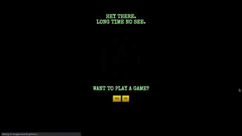

# Bill Cipher's Kdqjpdq!

## Gravity Falls Hangman

## Live @ [douglasmackrell.github.io/Gravity-Falls-Hangman](https://douglasmackrell.github.io/Gravity-Falls-Hangman/)

[](https://douglasmackrell.github.io/Gravity-Falls-Hangman/)

### Created by [Douglas MacKrell](https://douglasmackrell.com)

[](https://dougmackrell.com)

<a href="https://www.linkedin.com/in/douglasmackrell/"></a> [linkedin.com/in/douglasmackrell](https://www.linkedin.com/in/douglasmackrell/)

<a href="https://twitter.com/DouglasMacKrell"></a> [twitter.com/DouglasMacKrell](https://twitter.com/DouglasMacKrell)

<a href="https://youtube.com/bigmackrell"></a> [youtube.com/bigmackrell](https://youtube.com/bigmackrell)

<a href="mailto:bigmackrell+github@gmail.com?subject=[GitHub]"></a> [bigmackrell@gmail.com](mailto:bigmackrell+github@gmail.com?subject=[GitHub])

---

## VIDEO

<a href="http://www.youtube.com/watch?feature=player_embedded&v=aMwQ52vcu1U" target="_blank"></a>  
* [Bill Cipher's Kdqjpdq! (A Gravity Falls Hangman Game)](https://youtu.be/aMwQ52vcu1U)

## FEATURES

* Single player launches game from start screen
* Player is guided through story elements establishing the game rules
* A secret word is randomly selected from a dictionary of Gravity Falls themed words
  * Player is shown this word encoded with the Caesar Cipher set 3 letters back
  * Secret word is also represented with blanks represent each letter
* Game listens for keypress for user to select a single letter character
* After user submits guess:
  * IF CORRECT
    * Matching letter swaps with representative blanks
    * Game captures guess and displays used letter to user
    * Game blocks letter from being guessed again
  * IF INCORRECT
    * An energy orb is displayed around Bill Cipher marking a lost chance
    * Game records and increments wrong answer counter
    * Game captures guess and displays used letter to user
    * Game blocks letter from being guessed again
* IF USER GUESSES ALL POSSIBLE LETTERS IN SECRET WORD
  * Win state activated
    * User is displayed a triumphant gif from Gravity Falls
    * User is asked if they want to play again
      * If button is pressed, game is reset
* IF USER EXCEEDS 7 WRONG GUESSES
  * Lose state activated
    * User is shown a disheartening gif from Gravity Falls 
    * The secret word is revealed to the User so they know what the answer was
    * User is asked if they want to play again
      * If button is pressed, game is reset

## FUTURE FEATURES

* Add a player select and allow users to choose between DIPPER, MABEL, and GRUNKLE STAN
* Add different encryption methods for each available character to encourage replay
* Expand dictionary with even more Gravity Falls words

## TECHNICAL MILESTONES

* Single page HTML web app using CSS and JavaScript to control what is displayed to the User
* Encryption method used to encode secret word with the Caesar Cipher set 3 letters back
* Audio playback
* CSS3 Grid based layout

## TECHNOLOGIES USED

* **JavaScript**
* **HTML5**
* **CSS3**

## LOCAL SETUP

**NOTE: You must have a web browser installed to run this game.**

1. Clone this repo into a folder of your choice:
```
       git clone https://github.com/DouglasMacKrell/Gravity-Falls-Hangman.git
```

2. Open `index.html` in a web browser

3. A new browser tab should have been opened and the App should be running. If that is not the case check the browser's inspector for errors. If you are unable to troubleshoot the problem, I would be happy to address issues so open [one](/issues)

---

### Please check out one of my favorite projects, [DougTV!](https://dougtv.herokuapp.com)

---

[](https://dougtv.herokuapp.com)

---

<details>
    <summary>
        Before you leave, please take note:
    </summary>

You're the best! Thank you for visiting!

Please give this project a star and be sure to check out my [YouTube Channel](https://youtube.com/BigMacKrell)!

</details>
